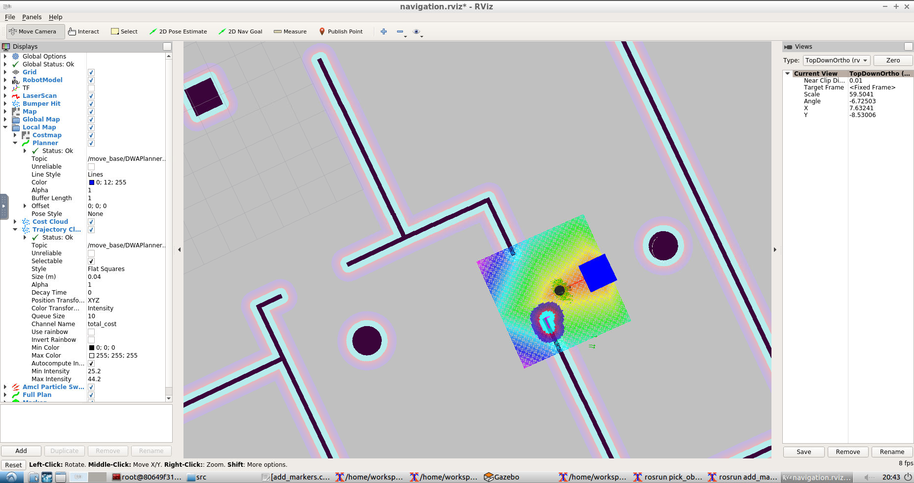

# Home Service Robot

[](https://www.udacity.com/robotics)

This is the final project of Udacity's Robotics Software Engineer Nanodegree. 
I used Turtlebot and the world from my [previous project](https://github.com/korhanmd/udacity-where-am-i).
The mission of the robot is picking an object and bring it to the goal.
First, the robot moves to the pick up point. There is a blue square on the pick up point. This square represents the object that will be pick up.
When robot reached the pick up point, it picks up the object and the blue square disappears. Then, robot moves to the drop off point.
When it reached the drop off point, it drops off the object and the blue square appers on the drop off point.



### Running the Project

You need to clone this repo in a `catkin_ws` and change its name to the `src`. Write `catkin_make` in the root directory of catkin_ws to compile it.
Write `source devel/setup.bash` after compiled. To install dependencies of packages write below commands.

```
$ rosdep -i install gmapping
$ rosdep -i install turtlebot_teleop
$ rosdep -i install turtlebot_rviz_launchers
$ rosdep -i install turtlebot_gazebo
```

To run the application write `./src/scripts/home_service.sh` to the terminal in the root directory of catkin_ws.

### Project Tree

```
    ├──                                # Official ROS packages
    |
    ├── slam_gmapping                  # gmapping_demo.launch file                   
    │   ├── gmapping
    │   ├── ...
    ├── turtlebot                      # keyboard_teleop.launch file
    │   ├── turtlebot_teleop
    │   ├── ...
    ├── turtlebot_interactions         # view_navigation.launch file      
    │   ├── turtlebot_rviz_launchers
    │   ├── ...
    ├── turtlebot_simulator            # turtlebot_world.launch file 
    │   ├── turtlebot_gazebo
    │   ├── ...
    ├──                                # Your packages and direcotries
    |
    ├── map                          # map files
    │   ├── ...
    ├── scripts                   # shell scripts files
    │   ├── ...
    ├──pick_objects                    # pick_objects C++ node
    │   ├── src/pick_objects.cpp
    │   ├── ...
    ├──add_markers                     # add_marker C++ node
    │   ├── src/add_markers.cpp
    │   ├── ...
    └──
```

### Packages

There are six packages in the project. The four of them are previously written packages.
These packages are `gmapping`, `turtlebot`, `turtlebot_interactions`, and `turtlebot_simulator`.
`slam_gmapping` package is for SLAM operations. `turtlebot` package is used to control robot with teleop keys.
`turtlebot_interactions` package is for rviz launcher. `turtlebot_simulator` package is for Gazebo simulator launcher.

I wrote two packages to make the robot complete its mission. These packages are `pick_objects` and `add_markers`.

#### Pick Objects

`pick_objects` package includes `pick_objects` node. It sends pick up and drop off points to the move_base action server.
According the state of the action server it determines the status of the robot. This status has three values.
These are "robot will pick up the object", "the robot picked up the object", and "the robot dropped off the object".
It publishes status of the robot to `robot_status` topic.

#### Add Markers

`add_markers` package includes `add_markers` node. It publishes to `visualization_marker` to draw a blue square which represents the object.
It subscribes to `robot_status` topic to get status of the robot and determine where to draw the object.
If the robot didn't pick up the object yet, it draws it on the pick up point. If robot picked up the object, it deletes object.
If the robot reached to the goal point and dropped off the object, it draws it on the drop off point.
